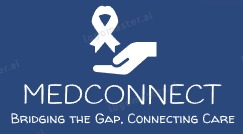

# MedConnect – Bridging the Gap, Connecting Care.

MedConnect is not just a platform—it’s a revolution in cancer care. By harnessing AI-driven medical intelligence, we dismantle barriers to treatment, transforming chaos into clarity for underprivileged patients. With cutting-edge medical record organization, intelligent patient navigation, and automated financial aid discovery, we empower patients with swift diagnoses, structured guidance, and unwavering support. Arogyam redefines healthcare accessibility, ensuring no patient is lost in complexity—because every life deserves a fighting chance.

-------

## Project Overview
Revolutionizing Cancer Care with AI-Powered Support
Cancer care is not just about treatment—it’s about access, guidance, and support. Many underprivileged patients struggle with treatment delays, disorganized medical records, financial burdens, and a lack of structured assistance, making their fight against cancer even harder.

MedConnect is an AI-driven healthcare platform designed to bridge these gaps, ensuring that every patient receives timely care, clear guidance, and financial aid without unnecessary delays. Our intelligent patient navigation system connects patients with certified navigators, social workers, and doctors, while our AI-powered medical record management (RAG technology) organizes unstructured data for instant, hassle-free access to patient history.

Beyond treatment, Arogyam provides emotional and community support, ensuring that no patient fights alone. With AI-driven financial aid discovery, real-time updates, and multilingual chatbot assistance, we are making cancer care more accessible, structured, and patient-centric—because healthcare should heal, not hinder.

-------

## Inspiration
Our inspiration for MedConnect comes from the countless stories of cancer patients lost in a maze of paperwork, long wait times, and inaccessible resources—barriers that often delay treatment and worsen outcomes. We saw the urgent need for a seamless, AI-powered solution that could bring clarity, guidance, and hope to those who need it most.

Cancer is a battle no one should fight alone, yet countless underprivileged patients face delays, confusion, and financial struggles that make treatment even harder. Many lose precious time—not to the disease, but to disorganized systems and inaccessible support.
MedConnect was born from a vision to change this. Inspired by the struggles of real patients, we are leveraging AI-driven solutions to bring clarity, speed, and guidance to those who need it most. By breaking down barriers in medical record management, patient navigation, and financial aid discovery, we ensure that healthcare becomes a right, not a privilege. Because in the fight against cancer, every second counts. 

--------

## Key Features:

### **🏥 AI-Powered Medical Record Management**
Navigating unstructured medical records is a nightmare for patients and caregivers. Our AI-driven Retrieval-Augmented Generation (RAG) system organizes and indexes medical reports, prescriptions, and diagnostics, enabling instant access to critical information. This eliminates delays, enhances treatment accuracy, and ensures patients receive the right care at the right time.

### **🤝 Intelligent Patient Navigator**
Cancer treatment is more than just medical procedures—it’s a complex journey. Our AI-powered patient navigator connects individuals with certified professionals—nurses, social workers, and survivors—who provide step-by-step guidance, appointment tracking, reminders, and personalized support. With multilingual chatbot & voice assistance, we break language barriers and ensure no patient feels lost or alone.

### **🔍 AI-Driven Treatment Insights**
Every second counts in cancer care. Our platform analyzes medical records and offers personalized treatment insights by cross-referencing global best practices. By leveraging AI, we help doctors and patients make informed decisions faster, leading to better outcomes and optimized care plans.

### **🌐 Seamless Doctor-Patient Connection**
Eliminating long hospital wait times, our platform creates a verified doctor network that enables direct teleconsultations, follow-ups, and real-time treatment tracking. Patients can access trusted professionals instantly, reducing treatment delays and ensuring continuity of care.

### **💬 AI-Powered Mental Health & Community Support**
Cancer is a battle fought on both physical and emotional fronts. Our AI-driven mental health check-ins provide early intervention and personalized well-being programs. Patients can join peer support groups, interact with counselors, and find strength in shared experiences—because healing goes beyond medicine.

------------

## Technology Stack

**Frontend 🎨**:

✅ EJS – Dynamic templating engine for rendering views.

✅ HTML, CSS, JavaScript – Core web technologies for structure, styling, and interactivity.

✅ Bootstrap 5 – Modern, responsive UI framework for styling.

**Backend ⚙️**:
✅ Node.js + Express.js – Scalable backend framework for APIs and server-side logic.

**Database & Storage 📂**:

✅ MongoDB Atlas – Cloud-based NoSQL database for efficient data management.

✅ Mongoose – ODM (Object Data Modeling) library for MongoDB.

✅ Cloudinary – Secure cloud storage for medical records and patient files.

**AI Integration 🤖**:

✅ Google Gemini 2.0 Flash – AI-powered health risk assessment and smart record search.

✅ Groclake – NLP model for processing and understanding patient queries.

✅ Modellake – AI workflow management for advanced decision-making and automation.

**Authentication & Security 🔐**:

✅ Passport.js – Secure authentication system for user login and session management.

**Deployment & Hosting 🚀**:

✅ Render – Cloud hosting for frontend, backend, and database services.

-------------

## Revenue Model

### 1️⃣ Strategic Partnerships & Hospital Integration

Partner with hospitals, clinics, and NGOs to onboard doctors & patient navigators.

Collaborate with government healthcare programs for financial aid integration.

### 2️⃣ AI-Driven Subscription Model

Freemium: Free medical record management & chatbot support.

Premium: AI-driven reports, personalized care plans, priority teleconsultation.

### 3️⃣ B2B Healthcare SaaS Model

Offer Arogyam as a SaaS to hospitals & insurance companies.

Provide data-driven decision-making through predictive analytics.

### 4️⃣ Crowdfunding & Financial Aid Integration

Build a donation & crowdfunding platform to connect patients with donors.

Enable automated eligibility checks for government & NGO grants.

### 5️⃣ Regional & Global Expansion

Focus on Indian rural & semi-urban areas, then expand to other chronic diseases.

Localize chatbot for multiple languages & healthcare systems for global reach.

### 6️⃣ AI-Powered Insights for Pharma & Research

Provide anonymized medical data to pharma companies for research.

Collaborate with universities & research labs for innovation in cancer care.

### 7️⃣ Scalable Tech Infrastructure

Use cloud-based microservices for scalability & automation.

Ensure HIPAA & GDPR compliance for security & privacy.

---------

## **🚧 Challenges We Ran Into**  

### **1️⃣ Implementing Retrieval-Augmented Generation (RAG) 🤖📚**  
Integrating **RAG** for AI-driven responses was a complex challenge. Ensuring **accurate, context-aware retrieval** of patient records and medical information required **efficient embedding techniques, optimized vector searches, and fine-tuning for relevance**. Handling **medical terminology and contextual accuracy** was crucial to avoid misinformation.  

### **2️⃣ Deployment & Scalability 🌐🚀**  
Deploying a **resource-intensive AI-driven healthcare platform** came with several hurdles. Managing **real-time AI computations, secure cloud-based storage (for medical records), and API rate limits** required extensive **optimization and load balancing**. Ensuring **data privacy & compliance with healthcare regulations** (HIPAA/GDPR) added another layer of complexity.  

### **3️⃣ AI-Driven Treatment Plan Suggestion 📑🧠**  
Designing an AI system capable of **analyzing extensive medical reports and generating personalized treatment plans** was a significant challenge. The AI had to process **large-scale unstructured data**, extract meaningful insights from **lab reports, radiology scans, and doctor’s notes**, and suggest **customized treatment plans** for doctors. Ensuring **accuracy, interpretability, and reliability** while maintaining **doctor oversight** was critical to making AI-assisted diagnosis both **trustworthy and effective**.

Despite these challenges, we **iterated, optimized, and refined our models** to build a **robust, intelligent, and scalable healthcare solution** that bridges the gap between **patients, doctors, and accessible medical care**. 🚀

-----------

## **What’s Next: Future Directions**  

As we continue to refine and expand **MedConnect**, our vision is to revolutionize cancer care accessibility by integrating cutting-edge technology and community-driven support. Here’s what’s coming next:  

### **🗣️ Multilingual Support for Inclusive Care**  
Healthcare should have no language barriers. We aim to implement **multilingual support**, allowing patients to interact with our platform in their **native languages**, ensuring clear communication between patients, doctors, and navigators. This will be a game-changer for **rural and underprivileged communities** where language is a major hurdle in seeking medical help.  

### **🌍 AI-Driven Treatment & Research Insights**  
We are enhancing our **AI-powered treatment recommendations** by integrating **real-world research data**, patient history, and clinical guidelines. This will **assist doctors with more precise treatment suggestions**, helping them tailor care plans based on **global medical advancements** while reducing diagnostic delays.  

### **💰 Financial Aid & Support System**  
Medical expenses can be overwhelming, especially for cancer patients. We plan to introduce an **AI-powered financial assistance system** that helps patients find **government schemes, NGO grants, and crowdfunding options** in real-time. This will significantly **reduce financial stress** and ensure that no one is denied treatment due to affordability.  

### **🤝 Advanced Training for Patient Navigators**  
We will introduce an **AI-based training and certification system** for patient navigators, ensuring they are well-equipped to guide patients effectively. This will establish a **verified network of trained professionals** who can provide **personalized assistance** to patients, making navigation through the healthcare system seamless and efficient.  

### **🚀 Seamless Nationwide Expansion**  
Our long-term goal is to **scale MedConnect across hospitals, NGOs, and government health initiatives**, ensuring widespread adoption and impact. By partnering with **healthcare providers, policymakers, and tech leaders**, we aim to make **MedConnect the go-to platform for accessible cancer care**—bringing hope, clarity, and structured medical assistance to millions.  

The future of healthcare is **connected, intelligent, and patient-centric**—and **MedConnect** is leading the way! 💙
